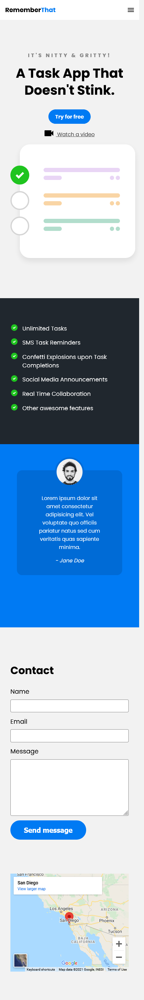

# Front-End

## Table of Contents
1. Certificates 
2. Task App Project
3. Food Website Project

## Certificates 
1. HTML5 - Completed  
2. CSS   - In Progress

 
## Task App Project 
Utilized HTML, CSS & a bit of JavaScript to create a mobile first website design. 
 1. Phone/Mobile 
 2. Tablet
 3. PC  

### 1. Phone view

  

### 2. Tablet view
  

### 3. PC view 

 

## Food Website Project 
_(Located in the Food Folder)_  

Utilized HTML, CSS & a bit of JavaScript to create a website layout that works on multiple devices.
 1. Phone/Mobile 
 2. Tablet
 3. PC  
 #### Phone  

#### Tablet  
 
#### PC  
 

